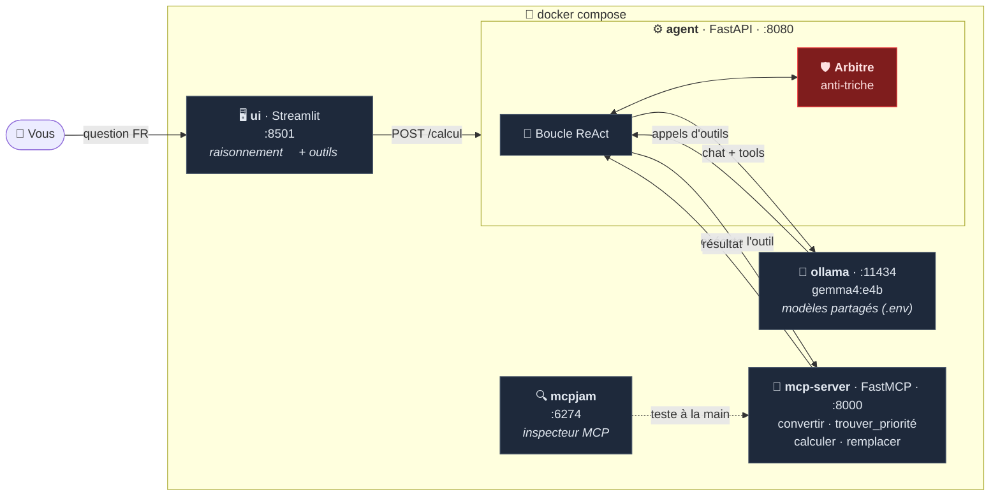
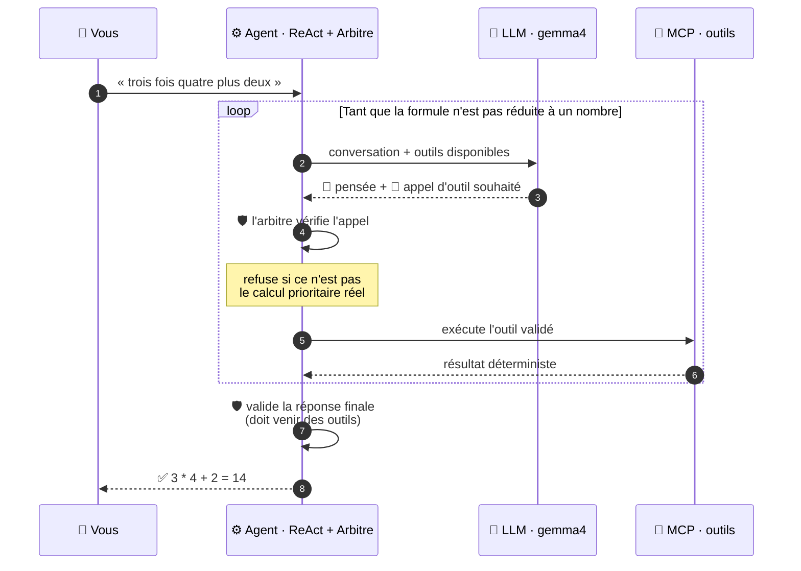

# 🧮 Tutoriel : un agent ReAct + MCP avec un petit LLM local, sans triche

Un projet **entièrement dockerisé** où un petit LLM local résout des calculs
posés en français — « *trois fois quatre plus deux* » — **sans jamais
calculer lui-même** : chaque opération passe par des outils exposés via
**MCP** (Model Context Protocol), et un **arbitre** vérifie chaque étape.
Si le modèle tente de répondre de tête, il est refusé.

## Architecture



**Le flux d'une question** (« trois fois quatre plus deux » → 14) :



## Les briques

| Service | Port | Rôle |
|---|---|---|
| `ui` | 8501 | **Streamlit** : on voit le raisonnement du modèle (💭) et chaque appel d'outil MCP (🔧) |
| `agent` | 8080 | Boucle **ReAct** écrite à la main + **arbitre anti-triche** (API `POST /calcul`) |
| `mcp-server` | 8000 | Serveur **FastMCP** : les 4 outils de calcul, découvrables par tout client MCP |
| `ollama` | 11434 | Le petit LLM local (`gemma4:e4b` par défaut) — aucun cloud |
| `mcpjam` | 6274 | **MCPJam** : inspecteur pour tester les outils MCP à la main |

### Les 4 outils MCP ([mcp_server/serveur.py](mcp_server/serveur.py))

1. **`convertir_texte_en_formule`** — « trois fois quatre plus deux » → `3 * 4 + 2`
   (nombres en lettres de 0 à 100, chiffres, décimaux, parenthèses).
2. **`trouver_calcul_prioritaire`** — `3 * 4 + 2` → « il faut d'abord faire `3 * 4` »
   (parenthèses d'abord, puis `*` `/`, puis de gauche à droite).
3. **`calculer`** — **exactement deux opérandes** et un opérateur : `(3, "*", 4)` → `12`.
4. **`remplacer_calcul_par_resultat`** — `3 * 4 + 2` + (`3 * 4`, `12`) → `12 + 2`.

La logique pure vit dans [outils_calcul.py](mcp_server/outils_calcul.py),
testable sans serveur ni LLM ; [serveur.py](mcp_server/serveur.py) ne fait que
l'exposer : une fonction Python + `@mcp.tool` = un outil découvrable par
n'importe quel client MCP.

### La boucle ReAct ([agent/boucle_react.py](agent/boucle_react.py))

À chaque itération : **Penser** (le LLM reçoit la conversation et la liste des
outils, découverte dynamiquement via MCP) → **Agir** (il demande un outil) →
**Observer** (le résultat lui est renvoyé) … jusqu'à la réponse finale.
L'agent n'a *aucune* connaissance codée en dur des outils : il les découvre
avec `client.list_tools()`. Les modèles qui « pensent » (gemma4, deepseek-r1…)
renvoient un champ `thinking` : il est capturé dans la trace (étapes 💭) mais
jamais renvoyé dans l'historique.

## Les modèles ne sont téléchargés qu'UNE fois (partage entre projets)

Chaque projet Docker qui crée son propre volume Ollama retélécharge les mêmes
gigaoctets. Ici, `.env` pointe vers un **dossier hôte partagé** :

```bash
# .env
OLLAMA_MODELES=/home/florian/mes_projets/feedbacks-projet/.ollama  # ~12 Go déjà en place
MODELE=gemma4:e4b
```

Le compose le monte dans le conteneur (`${OLLAMA_MODELES:-ollama_models}:/root/.ollama`) :
`gemma4:e4b` et `phi4-mini` sont disponibles immédiatement, zéro téléchargement.
Commentez la variable pour retomber sur un volume local au projet. Le service
`ollama-init` fait un `ollama pull` du modèle manquant au premier démarrage.

## Démarrage

Prérequis : Docker + Docker Compose.

```bash
docker compose up -d --build
```

Puis, au choix :

- **Interface Streamlit** : http://localhost:8501 — posez une question, puis
  dépliez les étapes : 💭 raisonnement du modèle, 🔧 appels d'outils MCP
  (arguments + résultats), ⛔ refus de l'arbitre, ✅ réponse validée.
- **MCPJam (inspecteur MCP)** : http://localhost:6274 — ajoutez un serveur
  HTTP avec l'URL `http://mcp-server:8000/mcp/` et appelez les outils à la
  main, sans LLM.
- **API** :
  ```bash
  curl -X POST http://localhost:8080/calcul \
       -H "Content-Type: application/json" \
       -d '{"question": "trois fois quatre plus deux"}'
  ```
- **CLI avec trace pas-à-pas** :
  ```bash
  docker compose exec agent python -m agent.cli "trois fois quatre plus deux"
  ```

Exemple de sortie CLI (vraie exécution, gemma4:e4b) :

```
❓ trois fois quatre plus deux

  💭 The user wants me to start by converting the text "trois fois quatre plus
     deux" into a mathematical formula using the convertir_texte_en_formule tool…
  🔧 convertir_texte_en_formule({"texte": "trois fois quatre plus deux"})
     ↳ "3 * 4 + 2"
  🔧 trouver_calcul_prioritaire({"formule": "3 * 4 + 2"})
     ↳ {"termine": false, "gauche": 3.0, "operateur": "*", "droite": 4.0,
        "sous_expression": "3 * 4", "explication": "« * » et « / » sont prioritaires…"}
  🔧 calculer({"droite": 4, "gauche": 3, "operateur": "*"})
     ↳ 12.0
  🔧 remplacer_calcul_par_resultat({"formule": "3 * 4 + 2", "sous_expression": "3 * 4", "valeur": 12})
     ↳ "12 + 2"
  🔧 trouver_calcul_prioritaire({"formule": "12 + 2"})
     ↳ {…, "sous_expression": "12 + 2", "explication": "…de gauche à droite."}
  🔧 calculer({"droite": 2, "gauche": 12, "operateur": "+"})
     ↳ 14.0
  🔧 remplacer_calcul_par_resultat({"formule": "12 + 2", "sous_expression": "12 + 2", "valeur": 14})
     ↳ "14"

✅ 3 * 4 + 2 = 14 (8 itérations, réponse validée par l'arbitre)
```

## Lancer les tests

```bash
# Niveaux 1 à 3 : unitaires + intégration MCP + agent avec faux LLM (< 2 s, sans LLM)
docker compose --profile test run --rm tests

# Niveau 4 : bout en bout, stack complète + vrai LLM (~2 min avec gemma4:e4b)
docker compose --profile e2e run --rm tests-e2e
```

| Niveau | Fichier | Ce qui est prouvé |
|---|---|---|
| 1. Unitaire | [test_outils_calcul.py](tests/test_outils_calcul.py) | Les 4 outils sont corrects (50 cas, dont les garde-fous) |
| 2. Intégration | [test_serveur_mcp.py](tests/test_serveur_mcp.py) | Le vrai protocole MCP : découverte, appels, erreurs (client en mémoire) |
| 3. Agent | [test_agent_faux_llm.py](tests/test_agent_faux_llm.py) | La boucle + l'arbitre, avec des LLM scriptés honnêtes **et tricheurs** |
| 4. E2E | [test_e2e.py](tests/test_e2e.py) | Le vrai LLM résout, la trace prouve l'ordre des priorités, l'UI répond |

## L'anti-triche : trois niveaux de défense

Le but : **il doit être impossible que la réponse vienne du LLM lui-même.**

1. **Le prompt système** lui interdit de calculer. *Niveau faible : un prompt
   n'est jamais une garantie.*
2. **Les outils sont stricts** : `remplacer_calcul_par_resultat` refuse une
   sous-expression qui n'est pas LE calcul prioritaire, et refuse une valeur
   qui n'est pas le vrai résultat (le modèle ne peut pas « glisser » un
   chiffre inventé dans la formule).
3. **L'arbitre** ([agent/arbitre.py](agent/arbitre.py)) — la vraie garantie,
   en code, côté orchestrateur :
   - il suit l'état réel du calcul (formule courante, dernier résultat d'outil) ;
   - il vérifie chaque appel **avant** exécution : enchaînement imposé, et
     `calculer` doit porter sur le calcul prioritaire (vérité demandée au
     serveur MCP, jamais au LLM) ;
   - il **refuse toute réponse finale** tant que la formule n'a pas été
     réduite pas à pas par les outils, ou si le nombre annoncé diffère de la
     formule réduite. Le refus est renvoyé au LLM, qui doit recommencer.

Le test [`test_tricheur_total_rejete`](tests/test_agent_faux_llm.py) le
prouve : un faux LLM qui répond « 14 » direct — *le bon résultat !* — est
rejeté, car la réponse n'a pas été **construite** par les outils.

## Honnêteté pédagogique : le « guidage »

Un petit modèle suit mal un protocole en 4 outils sans aide. Trois constats
issus des tests réels sur `qwen2.5:1.5b` (reproduisez-les !) :

- avec un long prompt système détaillant le protocole, le modèle « calcule »
  tout seul en texte et n'appelle aucun outil ;
- une consigne glissée dans un résultat d'outil est **recopiée** au lieu
  d'être exécutée ;
- une consigne dans un message *user* séparé (« Appelle maintenant l'outil X
  avec … ») est suivie correctement.

L'agent envoie donc après chaque outil une consigne dérivée **uniquement des
résultats d'outils** (jamais d'un calcul caché) — et l'arbitre vérifie de
toute façon chaque appel. Avec un modèle plus capable, désactivez-le
(`GUIDAGE: "0"` dans l'environnement du service `agent`) pour voir s'il suit
le protocole seul.

Autres filets de sécurité visibles dans le code ([boucle_react.py](agent/boucle_react.py)) :

- les petits modèles émettent parfois l'appel d'outil en JSON *texte* plutôt
  que dans le champ structuré `tool_calls` ; la boucle le parse
  (`extraire_appel_textuel`) — c'est le ReAct « historique », où l'action est
  extraite de la sortie texte du modèle ;
- `num_predict` est plafonné : à température 0, un petit modèle peut partir
  en génération infinie (vécu : 5 minutes avant le timeout d'Ollama).

## Changer de modèle

```bash
# .env — tout modèle Ollama avec support des outils convient :
MODELE=gemma4:e4b      # défaut : raisonnement « thinking » visible, ~9,6 Go
MODELE=qwen2.5:1.5b    # mini (~1 Go), rapide, pas de thinking
MODELE=phi4-mini       # déjà présent dans le dossier partagé
```

Puis `docker compose up -d` (le service `ollama-init` télécharge ce qui manque
dans le dossier partagé — une seule fois pour tous vos projets).

## Arborescence

```
.
├── docker-compose.yml      # les 5 services + profils de test
├── .env                    # MODELE + OLLAMA_MODELES (dossier partagé)
├── mcp_server/
│   ├── outils_calcul.py    # logique pure (parseur FR, priorités, garde-fous)
│   └── serveur.py          # exposition FastMCP (4 outils + /sante)
├── agent/
│   ├── llm_ollama.py       # client /api/chat d'Ollama (interface : 1 méthode)
│   ├── arbitre.py          # l'anti-triche
│   ├── boucle_react.py     # la boucle Penser → Agir → Observer
│   ├── app.py              # API FastAPI (+ mini page HTML de secours)
│   └── cli.py              # trace pas-à-pas dans le terminal
├── ui/
│   └── app.py              # Streamlit : raisonnement + outils MCP visibles
└── tests/                  # 4 niveaux (cf. tableau ci-dessus)
```

## Limites connues (volontaires, pour rester lisible)

- Le parseur français couvre 0–100, `+ - * /`, décimaux et parenthèses ; pas
  de « mille », ni de puissances.
- Pas de nombres négatifs **en entrée** (mais les résultats intermédiaires
  négatifs sont gérés : « deux moins cinq plus dix » → 7).
- Un seul tour de question/réponse (pas de mémoire de conversation).

## Exercices pour aller plus loin

1. Ajoutez un outil `puissance(base, exposant)` — il faut toucher au parseur,
   aux priorités, et… à rien d'autre : l'agent découvre les outils tout seul.
2. Essayez `GUIDAGE=0` avec gemma4:e4b : le modèle suit-il le protocole sans
   aide ? Et qwen2.5:1.5b ?
3. Écrivez un test « LLM malicieux » de plus : par exemple un modèle qui
   appelle `calculer` avec les bons opérandes mais annonce ensuite un autre
   nombre dans `REPONSE FINALE`.
4. Dans MCPJam (http://localhost:6274), connectez `http://mcp-server:8000/mcp/`
   et tentez de tricher à la main : appelez `remplacer_calcul_par_resultat`
   avec une valeur fausse — l'outil refuse, sans aucun LLM dans la boucle.
