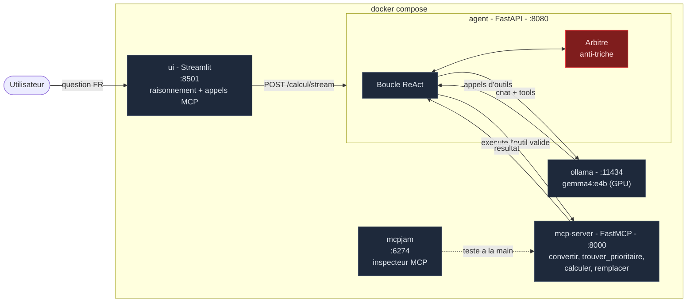
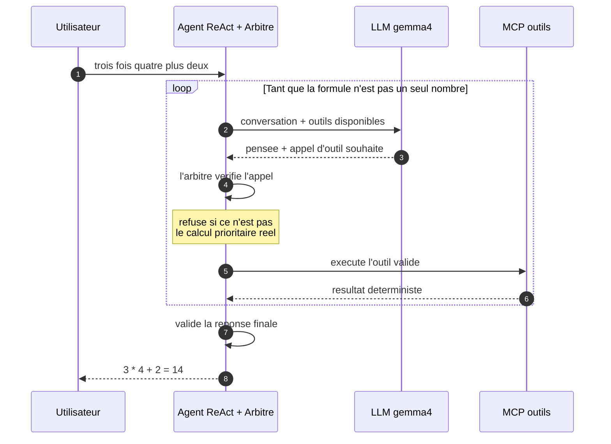

# Calculatrice agent ReAct + MCP avec un petit LLM local

Un projet **entièrement dockerisé**, pensé comme un **socle réutilisable** pour
construire des agents qui s'appuient sur des serveurs **MCP** (Model Context
Protocol). Le cas d'école : un petit LLM local résout des calculs posés en
français — « *trois fois quatre plus deux* » — **sans jamais calculer
lui-même**. Chaque opération passe par des outils exposés via MCP, et un
**arbitre** vérifie chaque étape : si le modèle tente de répondre de tête, il
est refusé.

L'objectif pédagogique : voir clairement **le raisonnement du modèle** et **les
appels MCP**, étape par étape, en direct dans une interface de chat.

> Documentation détaillée, en mode tutoriel, dans le dossier [`docs/`](docs/) :
> [l'agent ReAct](docs/agent.md) · [le serveur MCP](docs/mcp.md) ·
> [MCPJam, l'inspecteur](docs/mcpjam.md).

## Architecture



Le flux d'une question (« trois fois quatre plus deux » donne 14) :



## Les services

| Service | Port | Rôle |
|---|---|---|
| `ui` | 8501 | **Streamlit** en mode chat : raisonnement du modèle et appels MCP affichés **en direct** (streaming) |
| `agent` | 8080 | Boucle **ReAct** + **arbitre anti-triche**. API : `POST /calcul` (bloquant) et `POST /calcul/stream` (SSE) |
| `mcp-server` | 8000 | Serveur **FastMCP** : les 4 outils de calcul, découvrables par tout client MCP |
| `ollama` | 11434 | Le petit LLM local (`gemma4:e4b` par défaut), accéléré par le **GPU** |
| `mcpjam` | 6274 | **MCPJam** : inspecteur pour tester les outils MCP à la main, sans LLM |

## Démarrage rapide

Prérequis : Docker + Docker Compose. GPU nvidia recommandé (voir plus bas) mais
non obligatoire.

```bash
docker compose up -d --build
```

Puis :

- **Interface Streamlit** (recommandée) : http://localhost:8501
  Tapez une question, le raisonnement et les appels MCP s'affichent au fil de l'eau.
  (Les raccourcis développeur de Streamlit — dont la touche « C » qui ouvrait la
  boîte « Clear caches » au moindre Ctrl+C — sont désactivés via
  [`ui/.streamlit/config.toml`](ui/.streamlit/config.toml), `toolbarMode = "minimal"`.)
- **MCPJam** (inspecteur MCP) : http://localhost:6274
  Connectez le serveur `http://mcp-server:8000/mcp/` et appelez les outils à la main.
- **API** :
  ```bash
  curl -X POST http://localhost:8080/calcul \
       -H "Content-Type: application/json" \
       -d '{"question": "trois fois quatre plus deux"}'
  ```
- **CLI** (trace pas à pas dans le terminal) :
  ```bash
  docker compose exec agent python -m agent.cli "trois fois quatre plus deux"
  ```

## Accélération GPU

Le service `ollama` réserve un GPU nvidia dans [`docker-compose.yml`](docker-compose.yml) :

```yaml
deploy:
  resources:
    reservations:
      devices:
        - driver: nvidia
          count: 1
          capabilities: [gpu]
```

Ollama détecte et utilise le GPU automatiquement. Sur GPU, l'inférence passe de
**~2 minutes à quelques secondes** par question — c'est ce qui rend le streaming
agréable. Prérequis : le **nvidia-container-toolkit** installé côté hôte
(vérifiez avec `docker run --rm --gpus all --entrypoint nvidia-smi ollama/ollama:latest -L`).
Sans GPU nvidia, commentez le bloc `deploy` : Ollama tournera sur CPU.

## Modèles Ollama partagés entre projets

Pour ne pas retélécharger le même modèle dans chaque projet, `.env` pointe vers
un dossier hôte partagé :

```bash
# .env
OLLAMA_MODELES=/chemin/vers/un/dossier/.ollama   # monté sur /root/.ollama
MODELE=gemma4:e4b
```

Le compose le monte via `${OLLAMA_MODELES:-ollama_models}:/root/.ollama`.
Commentez la variable pour utiliser un volume Docker local au projet. Le service
`ollama-init` fait un `ollama pull` du modèle s'il manque, au premier démarrage.

## Les outils MCP

Définis dans [`mcp_server/serveur.py`](mcp_server/serveur.py), logique pure dans
[`mcp_server/outils_calcul.py`](mcp_server/outils_calcul.py). Deux familles,
volontairement, pour montrer les cas de figure.

**Outils pur Python, déterministes** (rapides, testables, robustes) :

1. **`convertir_texte_en_formule`** — « trois fois quatre plus deux » donne `3 * 4 + 2`
   (nombres en lettres de 0 à 100, chiffres, décimaux, et **parenthèses
   imbriquées** : `(trois plus ( 5 x 4 ) ) / 2` donne `( 3 + ( 5 * 4 ) ) / 2`).
2. **`trouver_calcul_prioritaire`** — `3 * 4 + 2` indique qu'il faut d'abord faire `3 * 4`
   (parenthèses les plus profondes d'abord, puis `*` et `/`, puis de gauche à droite).
3. **`calculer`** — **exactement deux opérandes** et un opérateur : `(3, "*", 4)` donne `12`.
4. **`remplacer_calcul_par_resultat`** — `3 * 4 + 2` plus (`3 * 4`, `12`) donne `12 + 2`.

**Outil LLM** (pour les formulations libres que le déterministe ne couvre pas) :

5. **`convertir_texte_en_formule_libre`** — délègue au modèle la compréhension
   d'une formulation inhabituelle (« le double de trois plus un » donne
   `2 * 3 + 1`), **mais sa sortie est revalidée par le tokeniseur déterministe** :
   si le LLM produit une formule invalide, l'outil échoue clairement. C'est le
   patron de robustesse clé : **le LLM propose, le code déterministe dispose.**

Pourquoi `calculer` ne prend que deux opérandes ? Parce que c'est **le coeur de
l'anti-triche** : en forçant une seule opération binaire à la fois, le modèle ne
peut pas faire un calcul à plusieurs étapes de tête. Il doit décomposer via les
outils, et l'arbitre vérifie que chaque opération est bien la prioritaire.
Détails dans [docs/mcp.md](docs/mcp.md) et [docs/agent.md](docs/agent.md).

## L'anti-triche : trois niveaux de défense

Le but : **il doit être impossible que la réponse vienne du LLM lui-même.**

1. **Le prompt système** lui interdit de calculer. *Niveau faible : un prompt
   n'est jamais une garantie.*
2. **Les outils sont stricts** : `remplacer_calcul_par_resultat` refuse une
   sous-expression qui n'est pas LE calcul prioritaire, et refuse une valeur qui
   n'est pas le vrai résultat.
3. **L'arbitre** ([`agent/arbitre.py`](agent/arbitre.py)) — la vraie garantie,
   en code, côté orchestrateur : il suit l'état réel du calcul, vérifie chaque
   appel **avant** exécution (la vérité « quel est le calcul prioritaire » est
   demandée au serveur MCP, jamais au LLM), et **refuse toute réponse finale**
   tant que la formule n'a pas été réduite pas à pas par les outils.

Le test `test_tricheur_total_rejete` le prouve : un faux LLM qui répond « 14 »
directement — *le bon résultat* — est rejeté, car la réponse n'a pas été
**construite** par les outils.

## Le streaming et l'interface chat

L'agent expose deux endpoints qui partagent **la même boucle** :

- `POST /calcul` renvoie tout en une fois (utilisé par l'API, la CLI, les tests) ;
- `POST /calcul/stream` émet chaque étape en **Server-Sent Events** dès qu'elle
  se produit.

Côté code, la boucle ReAct est un **générateur asynchrone** (`iter_evenements`)
qui `yield` chaque événement ; `resoudre` le consomme en bloquant, le streaming
le relaie en direct. L'UI Streamlit ([`ui/app.py`](ui/app.py)) consomme le flux
SSE et affiche pensées et appels MCP au fil de l'eau. Détails dans
[docs/agent.md](docs/agent.md).

## Lancer les tests

```bash
# Niveaux 1 a 3 : unitaires + integration MCP + agent avec faux LLM (rapide, sans LLM)
docker compose --profile test run --rm tests

# Niveau 4 : bout en bout, stack complete + vrai LLM
docker compose --profile e2e run --rm tests-e2e
```

| Niveau | Fichier | Ce qui est prouvé |
|---|---|---|
| 1. Unitaire | [test_outils_calcul.py](tests/test_outils_calcul.py) | Les 4 outils sont corrects (dont les garde-fous anti-triche) |
| 2. Intégration | [test_serveur_mcp.py](tests/test_serveur_mcp.py) | Le vrai protocole MCP : découverte, appels, erreurs |
| 3. Agent | [test_agent_faux_llm.py](tests/test_agent_faux_llm.py) | La boucle + l'arbitre, avec des LLM scriptés honnêtes **et tricheurs** |
| 4. E2E | [test_e2e.py](tests/test_e2e.py) | Le vrai LLM résout, la trace prouve l'ordre des priorités, l'UI répond |

## Arborescence

```
.
├── docker-compose.yml      # 5 services + profils de test
├── .env                    # MODELE + OLLAMA_MODELES (dossier partage)
├── mcp_server/
│   ├── outils_calcul.py    # logique pure (parseur FR, priorites, garde-fous)
│   └── serveur.py          # exposition FastMCP (4 outils + /sante)
├── agent/
│   ├── llm_ollama.py       # client /api/chat d'Ollama
│   ├── arbitre.py          # l'anti-triche
│   ├── boucle_react.py     # la boucle ReAct (generateur d'evenements)
│   ├── app.py              # API FastAPI (/calcul et /calcul/stream)
│   └── cli.py              # trace pas a pas dans le terminal
├── ui/
│   └── app.py              # Streamlit (chat + streaming des etapes)
├── tests/                  # 4 niveaux (voir tableau)
└── docs/                   # tutoriels : agent.md, mcp.md, mcpjam.md
```

## Réutiliser ce projet comme socle

Ce dépôt est conçu pour servir de point de départ à d'autres agents MCP :

1. **Changer de modèle** : modifiez `MODELE` dans `.env` (tout modèle Ollama
   supportant l'appel d'outils convient ; voir [docs/agent.md](docs/agent.md)).
2. **Ajouter un outil MCP** : une fonction Python + un décorateur `@mcp.tool`
   suffit ; l'agent le découvre tout seul. Pas à pas dans [docs/mcp.md](docs/mcp.md).
3. **Brancher un autre serveur MCP** : l'agent ne connaît aucun outil en dur, il
   les découvre via `list_tools()`. On peut pointer vers n'importe quel serveur
   MCP, voire en orchestrer plusieurs.
4. **Inspecter sans coder** : MCPJam permet de tester un serveur MCP à la main
   avant même d'écrire l'agent. Voir [docs/mcpjam.md](docs/mcpjam.md).

## Limites connues (volontaires, pour rester lisible)

- Le parseur français couvre 0 à 100, `+ - * /`, décimaux et parenthèses ; pas
  de « mille » ni de puissances.
- Pas de nombres négatifs **en entrée** (les résultats intermédiaires négatifs
  sont gérés : « deux moins cinq plus dix » donne 7).
- Un seul tour de question/réponse (pas de mémoire de conversation).
- Le streaming est au niveau **étape** (chaque pensée/appel apparaît en entier),
  pas au niveau **token**. Suffisant et lisible ; le token par token serait une
  évolution possible.

## Exercices pour aller plus loin

1. Ajoutez un outil `puissance(base, exposant)` — il faut toucher au parseur,
   aux priorités, et à rien d'autre : l'agent découvre l'outil tout seul.
2. Essayez `GUIDAGE=0` (variable d'environnement du service `agent`) avec
   gemma4 : le modèle suit-il le protocole sans aide ?
3. Dans MCPJam, connectez `http://mcp-server:8000/mcp/` et tentez de tricher :
   appelez `remplacer_calcul_par_resultat` avec une valeur fausse. L'outil
   refuse, sans aucun LLM dans la boucle.
