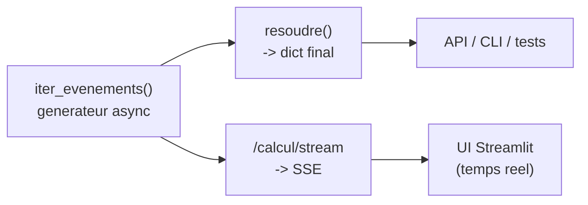

# Tutoriel — L'agent ReAct

Ce guide explique comment l'agent orchestre le LLM et les outils MCP, comment
l'arbitre empêche toute triche, et comment le streaming fonctionne. C'est le
coeur du projet.

## 1. ReAct, en une minute

**ReAct** (Reason + Act) est une boucle simple où le modèle alterne entre
**raisonner** et **agir** :

```
PENSER   -> le LLM reçoit la conversation et la liste des outils, il réfléchit
AGIR     -> il demande l'appel d'un outil (avec des arguments)
OBSERVER -> on exécute l'outil, on lui renvoie le résultat
... et on recommence, jusqu'à ce qu'il donne une réponse finale.
```

Ici, l'agent n'a **aucune** connaissance des outils codée en dur : il les
découvre via MCP (`list_tools()`). Le code de la boucle est dans
[`agent/boucle_react.py`](../agent/boucle_react.py), écrit à la main pour rester
lisible — pas de framework qui cache la mécanique.

## 2. Le déroulé d'une résolution

Pour « trois fois quatre plus deux » :

1. `convertir_texte_en_formule("trois fois quatre plus deux")` donne `3 * 4 + 2`
2. `trouver_calcul_prioritaire("3 * 4 + 2")` donne le calcul `3 * 4` (le `*` est prioritaire)
3. `calculer(3, "*", 4)` donne `12`
4. `remplacer_calcul_par_resultat("3 * 4 + 2", "3 * 4", 12)` donne `12 + 2`
5. `trouver_calcul_prioritaire("12 + 2")` donne `12 + 2`
6. `calculer(12, "+", 2)` donne `14`
7. `remplacer_calcul_par_resultat("12 + 2", "12 + 2", 14)` donne `14`
8. La formule est un seul nombre : réponse finale `14`.

À chaque tour, c'est le **LLM** qui décide quel outil appeler. L'agent, lui, ne
fait qu'exécuter et surveiller.

## 3. L'arbitre : la garantie anti-triche

Le problème : un LLM peut « tricher » en répondant `14` directement, sans passer
par les outils. Un prompt qui l'interdit ne suffit jamais. La vraie garantie est
en **code**, dans [`agent/arbitre.py`](../agent/arbitre.py).

L'arbitre maintient l'**état réel** du calcul (formule courante, dernier
résultat d'outil) et intervient à deux moments :

**Avant chaque appel d'outil** (`verifier_appel`) :

- l'enchaînement est imposé : on ne peut pas `calculer` avant d'avoir converti ;
- pour `calculer`, l'arbitre vérifie que l'opération demandée est bien **la
  prioritaire**. Et pour connaître la vérité, il interroge lui-même le serveur
  MCP (`trouver_calcul_prioritaire`) — **jamais** le LLM. C'est le point clé :
  la vérité terrain vient du code déterministe, pas du modèle.

**Sur la réponse finale** (`verifier_reponse_finale`) :

- elle n'est acceptée que si la formule a été **entièrement réduite, étape par
  étape, par les outils**, et que le nombre annoncé correspond à cette
  réduction. Sinon, le refus est renvoyé au LLM, et la boucle continue.

Conséquence : même si le modèle « connaît » la réponse, il ne peut pas la donner
tant qu'il ne l'a pas **construite** avec les outils. Le test
`test_tricheur_total_rejete` ([tests/test_agent_faux_llm.py](../tests/test_agent_faux_llm.py))
le démontre avec un faux LLM qui répond `14` d'emblée : rejeté.

## 4. Le guidage (et pourquoi il existe)

Un modèle de 1,5 milliard de paramètres suit mal un protocole en 4 outils. Trois
constats issus de tests réels (reproductibles) :

- avec un long prompt système détaillant le protocole, le modèle « calcule » en
  texte et n'appelle aucun outil ;
- une consigne glissée **dans un résultat d'outil** est recopiée au lieu d'être
  exécutée ;
- une consigne dans un **message utilisateur séparé** (« Appelle maintenant
  l'outil X avec ... ») est suivie correctement.

D'où le **guidage** : après chaque outil, l'agent envoie un message indiquant la
prochaine étape. Important : cette consigne est dérivée **uniquement des
résultats d'outils** (`_prochaine_etape`), jamais d'un calcul caché — et
l'arbitre vérifie de toute façon chaque appel. Le guidage aide le modèle à
suivre la forme du protocole, il ne lui souffle aucune réponse.

Avec un modèle plus capable, désactivez-le : variable d'environnement
`GUIDAGE=0` sur le service `agent`. C'est un bon exercice pour comparer.

Filet de sécurité supplémentaire : certains petits modèles émettent l'appel
d'outil en **JSON texte** au lieu du champ structuré `tool_calls`. La fonction
`extraire_appel_textuel` le récupère — c'est le ReAct « historique », où l'action
est parsée depuis la sortie texte du modèle.

## 5. Le champ « thinking » (raisonnement)

Certains modèles (gemma4, deepseek-r1...) renvoient leur raisonnement dans un
champ `thinking` distinct du contenu. L'agent le capture et l'émet comme
événement `pensee` (affiché dans l'UI), **mais ne le réinjecte pas** dans
l'historique envoyé au modèle (inutile et coûteux en contexte). C'est ce qui
permet de voir « ce que pense » le modèle sans polluer la conversation.

## 6. Architecture du streaming

La boucle est un **générateur asynchrone**, `iter_evenements(question)`, qui
`yield` chaque événement dès qu'il se produit :

```python
async for evenement in agent.iter_evenements(question):
    # evenement["type"] vaut : pensee | outil | refus_arbitre | erreur_outil | fin
    ...
```

C'est la **source unique de vérité**. Deux consommateurs, zéro logique dupliquée :

- **`resoudre(question)`** consomme tout le générateur et renvoie le dict final
  (avec la liste `etapes`). C'est ce qu'utilisent l'API `POST /calcul`, la CLI
  et les tests — comportement bloquant, identique à avant.
- **`POST /calcul/stream`** relaie chaque événement en **Server-Sent Events**
  (`data: <json>`) au fur et à mesure. L'UI Streamlit
  ([`ui/app.py`](../ui/app.py)) lit ce flux et affiche pensées et appels MCP en
  direct.



Le streaming est au niveau **étape** : chaque pensée ou appel apparaît en entier
dès qu'il est prêt. Le streaming **token par token** (afficher le raisonnement
mot à mot) serait possible en streamant la réponse d'Ollama, mais alourdirait le
code ; le niveau étape est déjà très lisible.

## 7. Le client LLM

[`agent/llm_ollama.py`](../agent/llm_ollama.py) est volontairement minimal : une
seule méthode `repondre(messages, outils)` qui appelle `/api/chat` d'Ollama.
Cette petite interface a deux vertus :

- elle est **remplaçable** : les tests injectent un faux LLM scripté (honnête ou
  tricheur) sans toucher à la boucle ;
- elle isole les détails d'Ollama (température 0 pour le déterminisme,
  `num_predict` pour éviter qu'un petit modèle parte en génération infinie,
  `keep_alive` pour garder le modèle chargé).

Pour viser un autre fournisseur (autre serveur compatible outils), il suffit de
réimplémenter cette unique méthode.

## 8. Adapter l'agent à un autre projet

- **Autre modèle** : changez `MODELE` dans `.env`. Tout modèle Ollama supportant
  l'appel d'outils convient. Sur un modèle costaud, testez `GUIDAGE=0`.
- **Autres outils / autre serveur MCP** : rien à changer dans la boucle, elle
  découvre les outils via `list_tools()`. Pointez `MCP_URL` ailleurs.
- **Logique métier de l'arbitre** : ici l'arbitre est spécifique au calcul. Pour
  un autre domaine, gardez le principe (vérité terrain via le serveur MCP, jamais
  via le LLM ; validation de la réponse finale) et réécrivez les vérifications.

## À retenir

- ReAct = Penser / Agir / Observer, en boucle, écrit à la main et lisible.
- L'agent ne connaît aucun outil en dur : découverte via MCP.
- L'anti-triche est en **code** (l'arbitre), pas dans le prompt : vérité terrain
  via le serveur MCP, réponse finale acceptée seulement si construite par les
  outils.
- Une seule boucle (générateur) sert le mode bloquant et le streaming.
